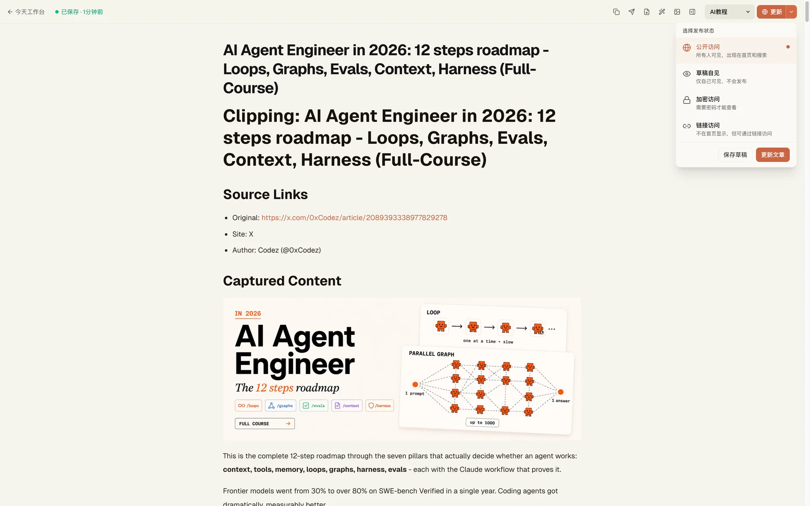
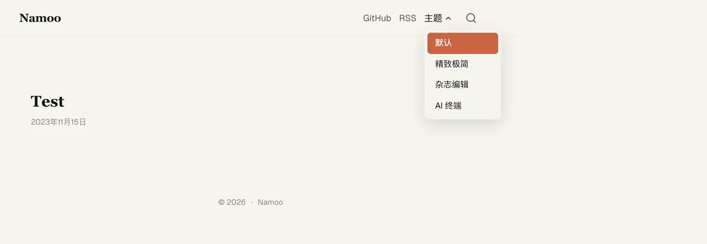
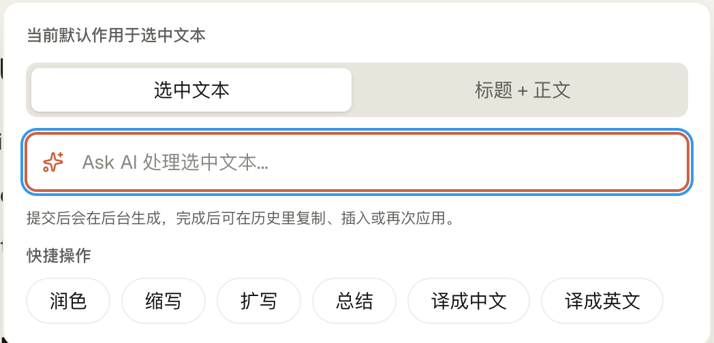
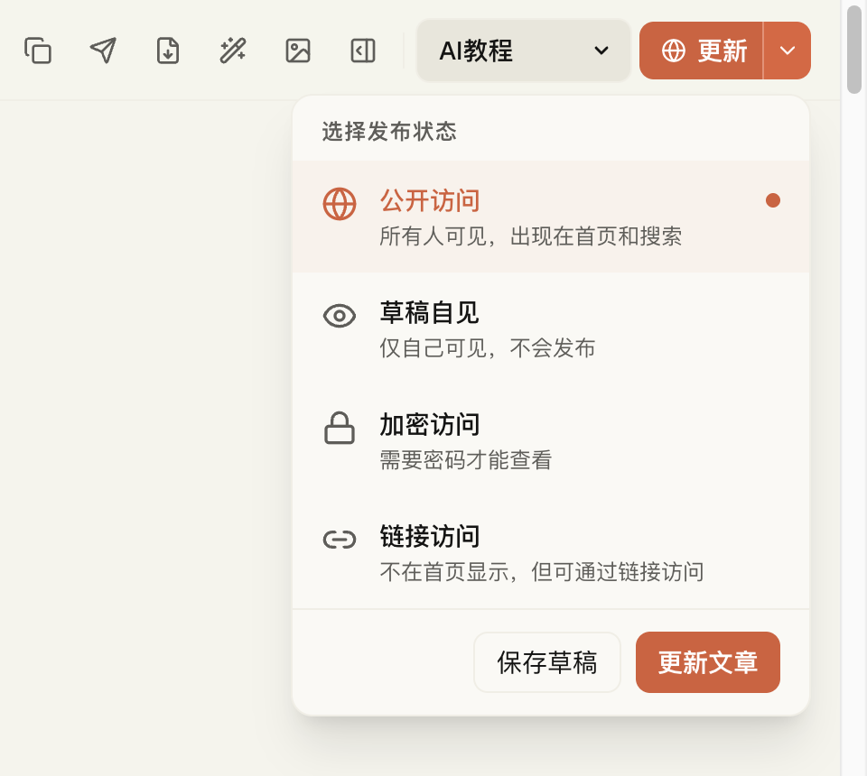

# Blogman

[English](README.md) | [简体中文](README.zh-CN.md)

[](https://deploy.workers.cloudflare.com/?url=https://github.com/nardinmarcus/blogman)
[](LICENSE)

**开源自托管博客平台，整套系统跑在 Cloudflare 上 —— Next.js 16 + Workers + D1 + R2。不是静态模板，而是完整的写作平台：所见即所得编辑器、AI 写作辅助、AI 生图、主题系统一应俱全。**



## 它做什么

Blogman 让你拥有一个完全属于自己的博客：在 Notion 风格的编辑器里写作，用 AI 润色、总结、打标签、配插图，从四套首页主题里挑一套直接用，再用细粒度的发布状态控制每篇文章的可见范围。所有东西都跑在 Cloudflare 边缘平台上 —— 没有服务器、数据库、CDN 需要你维护。

## 功能

**编辑器**
- 前台和后台双所见即所得编辑器（Tiptap / Novel）
- 气泡菜单 + Ask AI —— 选中文字即可改写、润色、扩写、翻译
- Markdown 导入导出、图片裁剪/对齐、YouTube 嵌入、数学公式块

**AI**
- 自动生成摘要、标签、SEO slug 和封面图
- 可配置的 AI 文本模型预设（OpenAI、Workers AI、自定义端点）
- AI 生图：模型模板 + 生成历史
- 图片右键菜单：下载、设为封面、裁剪、作为生图参考

**主题与发布**
- 4 套首页主题，移动端友好，开箱即用
- 发布状态：公开、草稿、密码访问、仅链接访问
- 首次初始化自动生成：导航、分类、字体、AI 模型模板

**基础设施**
- Cloudflare Workers + D1 + R2 —— 零运维
- API Token 支持外部集成
- 可选：后台任务、Workers AI、向量搜索、Cloudflare 图片管道

## 截图

| 首页主题 | Ask AI 气泡菜单 | 发布状态 |
| --- | --- | --- |
|  |  |  |

## 快速开始

需要 Node.js 20+ 和 npm。

```bash
git clone https://github.com/nardinmarcus/blogman.git
cd blogman
npm install
cp .env.example .env.local
npm run dev
```

入口：

- 博客首页：`/`
- 管理后台：`/admin`
- 编辑器：`/editor`

本地预览真实 Worker 运行时：

```bash
npm run preview
```

## 部署到 Cloudflare

点击上方的 **Deploy to Cloudflare** 按钮 —— 它会自动创建 D1 和 R2 资源，并通过 fail-closed 的迁移账本执行待应用的 D1 迁移。

> [!NOTE]
> 部署会在你自己的 Cloudflare 账号下创建资源（一个 Worker、一个 D1 数据库、一个 R2 存储桶），并要求你配置下列密钥。不经任何第三方基础设施。

| 密钥 | 说明 |
| --- | --- |
| `NEXT_PUBLIC_SITE_URL` | 博客公网域名，例如 `https://blog.example.com` |
| `ADMIN_PASSWORD` | 后台登录密码 |
| `ADMIN_TOKEN_SALT` | Token 签名盐（`openssl rand -hex 32` 生成） |
| `AI_CONFIG_ENCRYPTION_SECRET` | 加密存储 AI 供应商 Key（`openssl rand -hex 32` 生成） |
| `AI_API_KEY` | 可选。AI 服务的 API Key |

### 手动 CLI 部署

```bash
npm install
cp .env.example .env.local
npx wrangler login
npm run cf:init -- --site-url=https://your-domain.com
npm run build
npm run deploy
```

完整部署指南见 [DEPLOY.md](DEPLOY.md)。

## 生态

以下外部发布工具都接回同一个博客后端：

- [`ecosystem/chrome-clipper`](ecosystem/chrome-clipper/) —— 网页剪藏，直接进入博客草稿箱
- [`ecosystem/obsidian-publisher`](ecosystem/obsidian-publisher/) —— 从 Obsidian 一键发布
- [`ecosystem/namoo-blog-publisher`](ecosystem/namoo-blog-publisher/) —— Claude Skill / CLI 发布工作流

## 技术栈

| 层 | 技术 |
| --- | --- |
| 框架 | Next.js 16、React 19、TypeScript |
| 编辑器 | Novel / Tiptap |
| 运行时 | Cloudflare Workers |
| 数据库 | Cloudflare D1（SQLite） |
| 存储 | Cloudflare R2 |
| 样式 | Tailwind CSS 4 |
| AI | OpenAI SDK、Workers AI（可选） |
| 构建 | OpenNext for Cloudflare |

<details>
<summary>Schema 迁移</summary>

D1 schema 变更统一走 fail-closed、基于账本的迁移 runner（`scripts/migrations.mjs`），提供 `plan` / `status` / `verify` / `apply` 命令。详见 [`db/MIGRATIONS.md`](db/MIGRATIONS.md)。

</details>

## 开发

| 命令 | 说明 |
| --- | --- |
| `npm run dev` | 本地开发服务器 |
| `npm run build` | 生产构建 |
| `npm run preview` | Worker 运行时预览 |
| `npm run deploy` | 部署到 Cloudflare Workers |
| `npm run cf:init` | 初始化 Cloudflare 资源和默认数据 |
| `npm run test` | 监听模式跑测试（Vitest） |
| `npm run test:run` | 单次跑测试（CI 模式） |
| `npm run verify:quick` | Lint + 测试 + 构建 |
| `npm run verify` | 完整验证流程（含 OpenNext 构建） |

## 文档

- [DEPLOY.md](DEPLOY.md) —— 部署指南
- [db/MIGRATIONS.md](db/MIGRATIONS.md) —— D1 迁移 runner
- [docs/adr](docs/adr/) —— 架构决策记录
- [ecosystem/README.md](ecosystem/README.md) —— 配套发布工具

## 许可证

[MIT](LICENSE)
